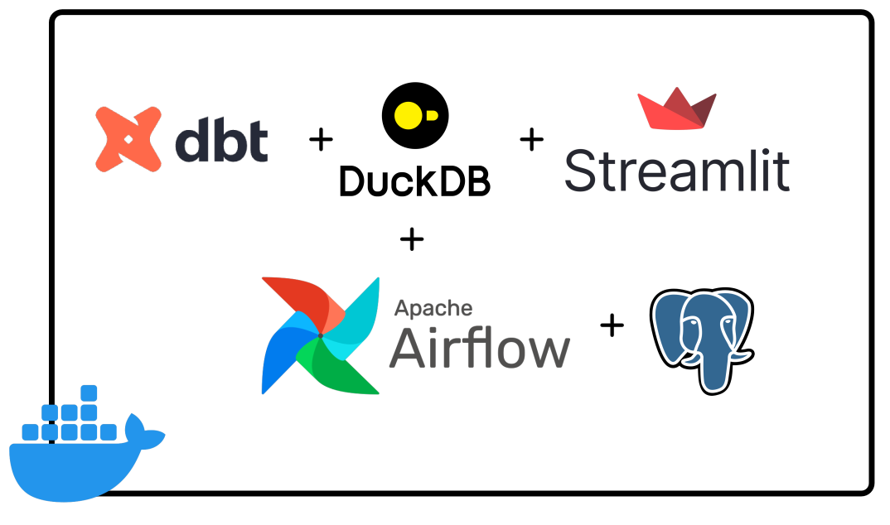
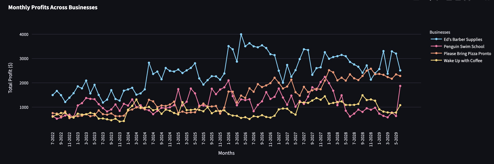
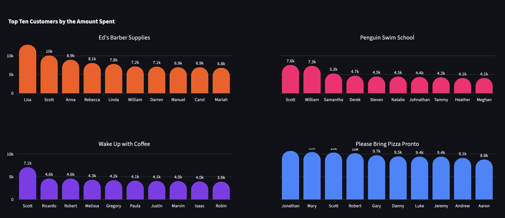

# Receipts Analytics — Airflow + dbt + DuckDB + Streamlit

A self-contained analytics engineering project that ingests raw receipt data,
transforms it with a layered dbt project orchestrated by Apache Airflow, and
serves the results through a Streamlit dashboard — all on DuckDB, running under
Docker with no external services required.

> Originally built as a Data Carpentry assignment (IFQ718), now reworked into a
> portfolio project demonstrating a production-shaped ELT pipeline.



## The questions

The pipeline answers three questions about four small businesses:

1. Are there periods of the year where some businesses are more profitable?
2. Which customers were most loyal to each business?
3. What is the employee turnover rate of each business?

## Architecture

```text
 JSON receipts                Airflow (asset-scheduled)                 Streamlit
 data/receipts/*.json   ->   raw_receipts asset  ──►  dbt (via Cosmos)   dashboard
                             (DuckDB read_json)       one task/model+test   (read-only)
                                    │                        │                 ▲
                                    ▼                        ▼                 │
                              main.raw_receipts   ─►   staging → intermediate → marts
                                                            (all in DuckDB: receipts.duckdb)
```

- **Ingestion** ([dags/receipts.py](./dags/receipts.py)) — an Airflow *asset*
  lands every JSON receipt into `main.raw_receipts` using DuckDB's native
  `read_json` (typed structs/lists, no pandas).
- **Transformation** ([dags/dbt.py](./dags/dbt.py)) — [astronomer-cosmos](https://astronomer.github.io/astronomer-cosmos/)
  renders the dbt project into a DAG with **one task per model plus its tests**.
  It is asset-scheduled, so it runs whenever `raw_receipts` is refreshed.
- **Serving** ([dashboard/](./dashboard/)) — Streamlit reads the marts
  read-only from the same DuckDB file.

## Data model (dbt)

The dbt project ([dbt/receipts_analytics/](./dbt/receipts_analytics/)) follows
the conventional **staging → intermediate → marts** layering:

| Layer | Materialization | Models | Purpose |
|---|---|---|---|
| `staging/` | view | `stg_*` (7) | One thin, renamed, typed model per entity, unnested from the raw JSON. Date is parsed to `DATE` once here. |
| `intermediate/` | view | `int_*` (6) | Reusable business logic (profit per receipt, customer spend, employee activity). Kept as views so they're inspectable. |
| `marts/` | table | `fct_*` / `dim_*` (5) | The tables the dashboard queries: monthly profit, top customers, employee attendance and turnover. |

**18 models, 44 data tests** (`not_null`, `unique`, `relationships`,
`accepted_values`, and `dbt_utils.unique_combination_of_columns`). Every model
and key column is documented in the `_*.yml` schema files, so `dbt docs generate`
produces a full lineage graph.

## Running it

### Prerequisites
- Docker (with Compose)
- Python 3.12 (for the local dbt virtualenv the containers mount)

### Full stack (Docker)
```bash
git clone <this-repo> && cd data-carpentry-airflow-dbt

# Build the dbt virtualenv that the Airflow containers mount at /opt/airflow/.venv
python3.12 -m venv .venv
source .venv/bin/activate
pip install -r requirements.txt

# (Linux) match container UID to avoid root-owned files; optional on macOS
echo "AIRFLOW_UID=$(id -u)" > .env

docker compose up
```

- Airflow UI: <http://localhost:8080> (login `airflow` / `airflow`). Trigger the
  `raw_receipts` asset; the `dbt_receipts_analytics` DAG runs automatically after.
- Streamlit dashboard: <http://localhost:8505>

### dbt only (no Airflow)
The whole transformation layer can be built and tested locally without Docker:

```bash
pip install "dbt-duckdb==1.9.4" "duckdb==1.3.1"
python scripts/build_local_db.py          # seed main.raw_receipts from the JSON
cd dbt/receipts_analytics
dbt deps
dbt build --target dev --profiles-dir .   # runs every model + data test
```

## Testing & CI

- `dbt build` runs all 44 data tests alongside the models.
- [scripts/smoke_test_dashboard.py](./scripts/smoke_test_dashboard.py) executes
  every Streamlit page headlessly (via `AppTest`) and fails on any exception.
- [.github/workflows/ci.yml](./.github/workflows/ci.yml) runs both on every push
  and pull request: seed → `dbt build` → dashboard smoke test.

## Notable design decisions

- **Local DuckDB for portability.** The pipeline writes one `receipts.duckdb`
  file (a build artifact, git-ignored) on a shared `warehouse` Docker volume;
  the dbt project (with its compiled manifest and packages) is baked into the
  image rather than mounted. The dashboard opens the file **read-only**, and the
  dbt DAG runs one model at a time (`max_active_tasks=1`) — both because DuckDB
  allows only a single writer. A served backend (MotherDuck, Postgres) would be
  the next step for true concurrent read/write at scale.
- **Cosmos over a bare `dbt run`.** Rendering per-model tasks makes lineage,
  retries and test failures visible in the Airflow UI instead of hidden inside
  one opaque BashOperator.
- **Turnover is computed, not hand-counted** (see below).

## Results

### Q1 — Seasonality of profit


- **Ed's Barber Supplies** grows year on year and peaks in the first five months.
- **Please Bring Pizza Pronto** is strong all year, roughly doubling profit every two years.
- **Penguin Swim School** dips mid-year (Australian winter) and grows only sporadically.
- **Wake Up with Coffee** grows modestly but is more stable than Penguin Swim School.

### Q2 — Most loyal customers
Loyalty is measured two ways — total spend and number of purchases — as
`fct_top_customers_by_spend` and `fct_top_customers_by_purchases`.



### Q3 — Employee turnover
Turnover is computed entirely in dbt (`fct_employee_turnover`), replacing an
earlier hand-counted spreadsheet-style calculation:

> `turnover_rate_pct = employees who left / headcount × 100`, per business per
> July–June fiscal year, where an employee is a cashier seen on receipts and a
> "departure" is their last active fiscal year.

The most recent fiscal year is **right-censored** — every still-employed person's
last active year is the final year, so a naïve count flags them all as leavers
(the spike the original manual analysis stumbled on). The model marks that year
`is_censored_period` and excludes it, giving believable turnover for these
micro-businesses (roughly 10–26% depending on the business).

---
*Data Carpentry (IFQ718) — by Jack Toke.*
