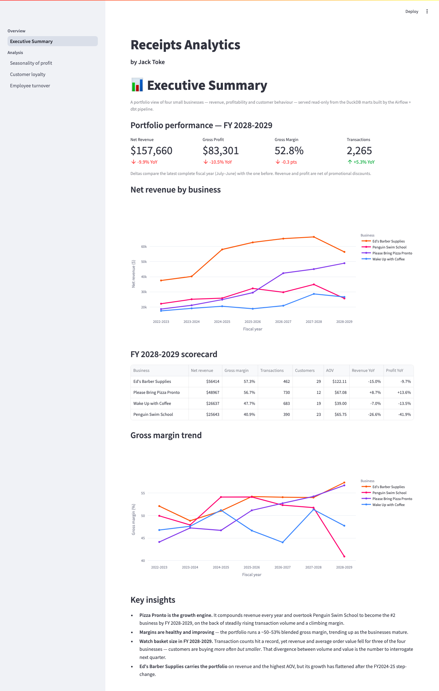
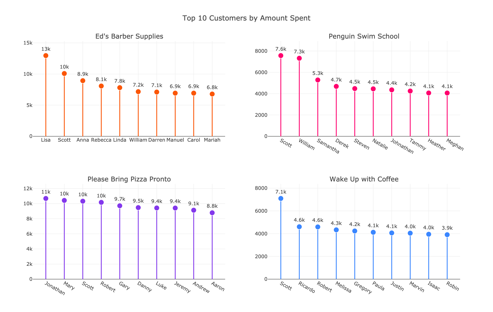
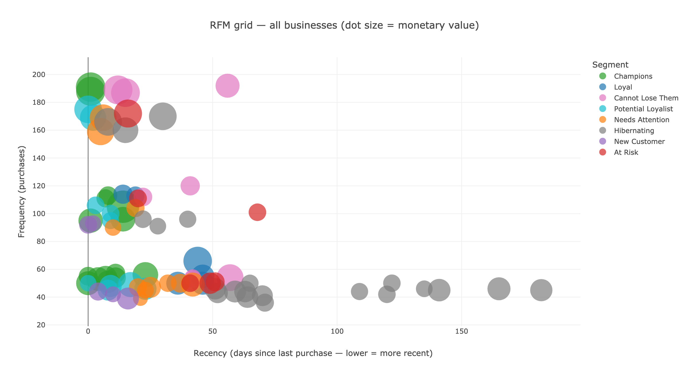
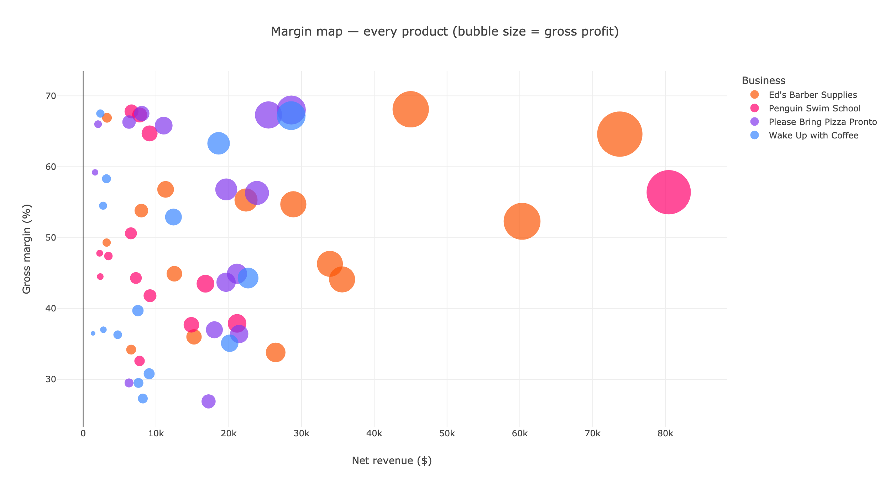

# Receipts Analytics — Airflow + dbt + DuckDB + Streamlit

An end-to-end **analytics engineering** project: it ingests raw JSON receipts for
four small businesses, transforms them through a layered, fully-tested dbt project
orchestrated by Apache Airflow, publishes a **KPI semantic layer**, and serves an
executive Streamlit dashboard — all on DuckDB, containerised, and deployed live.

**🔗 Live dashboard:** <https://data-carpentry-airflow-dbt-production.up.railway.app>
&nbsp;·&nbsp; **Stack:** Airflow · dbt (Cosmos) · DuckDB · Streamlit · Docker · Railway



## Key findings

From the KPI layer built over ~13,500 receipts across seven fiscal years:

- **Pizza Pronto is the growth engine** — it compounds revenue every year and
  overtook Penguin Swim School for the #2 spot on rising volume and margin.
- **Margins are healthy and improving** — a ~50–53% blended gross margin, trending
  up as the businesses mature.
- **Volume up, value down in the latest year** — transactions hit a record while
  revenue and average order value *fell* for three of the four businesses
  (customers buying more often but smaller) — the divergence to watch next.
- **Value concentrates in a few customers** — RFM segmentation flags a small
  *Champions* group driving an outsized share of revenue, plus an *At Risk /
  Cannot Lose Them* cohort worth a targeted win-back.
- **Selling ≠ earning** — product margins spread ~34–69%, so a business's top
  sellers by revenue are *not* its top earners; the margin map separates the
  "stars" from the high-volume, thin-margin "volume traps".

## What it answers

Beyond the headline KPIs — revenue, gross margin, transactions, AOV and
year-on-year growth per business per fiscal year — the dashboard drills into three
questions:

1. Are there periods of the year where some businesses are more profitable?
2. Which customers were most loyal to each business?
3. What is the employee turnover rate of each business?

…and extends the analysis with **RFM customer segmentation** and **product
margin & performance** (below) — turning raw receipts into named customer groups
and separating the products that sell from the products that *earn*.

## Architecture


```text
 JSON receipts                Airflow (asset-scheduled)                 Streamlit
 data/receipts/*.json   ->   raw_receipts asset  ──►  dbt (via Cosmos)   dashboard
                             (DuckDB read_json)       one task/model+test   (read-only)
                                    │                        │                 ▲
                                    ▼                        ▼                 │
                              main.raw_receipts   ─►   staging → intermediate → marts
                                                            (all in DuckDB: receipts.duckdb)
```

- **Ingestion** ([dags/receipts.py](./dags/receipts.py)) — an Airflow *asset*
  lands every JSON receipt into `main.raw_receipts` using DuckDB's native
  `read_json` (typed structs/lists, no pandas).
- **Transformation** ([dags/dbt.py](./dags/dbt.py)) — [astronomer-cosmos](https://astronomer.github.io/astronomer-cosmos/)
  renders the dbt project into a DAG with **one task per model plus its tests**.
  It is asset-scheduled, so it runs whenever `raw_receipts` is refreshed.
- **Serving** ([dashboard/](./dashboard/)) — Streamlit reads the marts
  read-only from the same DuckDB file. The landing page is an executive summary
  over the KPI mart; deeper pages answer each analytical question.

## Data model (dbt)

The dbt project ([dbt/receipts_analytics/](./dbt/receipts_analytics/)) follows
the conventional **staging → intermediate → marts** layering:

| Layer | Materialization | Models | Purpose |
|---|---|---|---|
| `staging/` | view | `stg_*` (7) | One thin, renamed, typed model per entity, unnested from the raw JSON. Date is parsed to `DATE` once here. |
| `intermediate/` | view | `int_*` (9) | Reusable business logic (profit per receipt, customer spend, employee activity, fiscal-year sales, customer RFM inputs, product sales). Kept as views so they're inspectable. |
| `marts/` | table | `fct_*` / `dim_*` (8) | The tables the dashboard queries: the KPI layer, monthly profit, top customers, RFM segments, product performance, employee attendance and turnover. |

The KPI layer ([`fct_business_kpis`](./dbt/receipts_analytics/models/marts/finance/fct_business_kpis.sql))
is the semantic layer the executive summary reads: revenue, gross margin,
transactions, unique customers, AOV and purchases-per-customer per business per
fiscal year, with year-on-year deltas computed once (via window `lag`) so every
consumer reports the same numbers.

**24 models, 63 data tests** (`not_null`, `unique`, `relationships`,
`accepted_values`, and `dbt_utils.unique_combination_of_columns`). Every model
and key column is documented in the `_*.yml` schema files, so `dbt docs generate`
produces a full lineage graph.

## Running it

### Prerequisites
- Docker (with Compose)
- Python 3.12 (for the local dbt virtualenv the containers mount)

### Full stack (Docker)
```bash
git clone <this-repo> && cd data-carpentry-airflow-dbt

# Build the dbt virtualenv that the Airflow containers mount at /opt/airflow/.venv
python3.12 -m venv .venv
source .venv/bin/activate
pip install -r requirements.txt

# (Linux) match container UID to avoid root-owned files; optional on macOS
echo "AIRFLOW_UID=$(id -u)" > .env

docker compose up
```

### Accessing the dashboards

> **No setup?** The Streamlit dashboard is deployed live at
> <https://data-carpentry-airflow-dbt-production.up.railway.app> — a read-only
> snapshot of the marts, no install required.

Once `docker compose up` is running, both UIs are served locally:

| Service | URL | Notes |
|---|---|---|
| **Airflow** | <http://localhost:8080> | Login `airflow` / `airflow`. Trigger the `raw_receipts` asset; the `dbt_receipts_analytics` DAG runs automatically after. |
| **Streamlit dashboard** | <http://localhost:8505> | Read-only view of the marts. Populates once the dbt DAG has run at least once. |

### dbt only (no Airflow)
The whole transformation layer can be built and tested locally without Docker:

```bash
pip install "dbt-duckdb==1.9.4" "duckdb==1.3.1"
python scripts/build_local_db.py          # seed main.raw_receipts from the JSON
cd dbt/receipts_analytics
dbt deps
dbt build --target dev --profiles-dir .   # runs every model + data test
```

### Live deployment (Railway)

The public dashboard runs as a self-contained container
([dashboard/Dockerfile](./dashboard/Dockerfile)): the image bakes in a prebuilt,
read-only DuckDB, so there is **no Airflow and no runtime build** in production —
it just serves the marts. [railway.json](./railway.json) points Railway at that
Dockerfile, and the service is connected to this repo so **every push to `main`
auto-deploys**. The dashboard's dependencies are pinned to an ABI-coherent native
stack (numpy 2.x / pyarrow / duckdb) so the image is reproducible across rebuilds.

## Testing & CI

- `dbt build` runs all 50 data tests alongside the models.
- [scripts/smoke_test_dashboard.py](./scripts/smoke_test_dashboard.py) executes
  every Streamlit page headlessly (via `AppTest`) and fails on any exception.
- [.github/workflows/ci.yml](./.github/workflows/ci.yml) runs both on every push
  and pull request: seed → `dbt build` → dashboard smoke test.

## Notable design decisions

- **Local DuckDB for portability.** The pipeline writes one `receipts.duckdb`
  file (a build artifact, git-ignored) on a shared `warehouse` Docker volume;
  the dbt project (with its compiled manifest and packages) is baked into the
  image rather than mounted. The dashboard opens the file **read-only**, and the
  dbt DAG runs one model at a time (`max_active_tasks=1`) — both because DuckDB
  allows only a single writer. A served backend (MotherDuck, Postgres) would be
  the next step for true concurrent read/write at scale.
- **Cosmos over a bare `dbt run`.** Rendering per-model tasks makes lineage,
  retries and test failures visible in the Airflow UI instead of hidden inside
  one opaque BashOperator.
- **Turnover is computed, not hand-counted** (see below).

## The analysis in detail

The executive summary (the hero above) reads `fct_business_kpis` and opens on the
latest complete fiscal year with portfolio totals and year-on-year movement. The
three analytical pages drill deeper:

### Q1 — Seasonality of profit


- **Ed's Barber Supplies** grows year on year and peaks in the first five months.
- **Please Bring Pizza Pronto** is strong all year, roughly doubling profit every two years.
- **Penguin Swim School** dips mid-year (Australian winter) and grows only sporadically.
- **Wake Up with Coffee** grows modestly but is more stable than Penguin Swim School.

### Q2 — Most loyal customers
Loyalty is measured two ways — total spend and number of purchases — as
`fct_top_customers_by_spend` and `fct_top_customers_by_purchases`.



### Customer segments (RFM)

Ranking the top customers answers *who* is valuable; **RFM segmentation** answers
*what to do about it*. It's a canonical customer-analytics technique that scores
every customer on three behaviours and buckets them into named, action-oriented
groups.

**How it's built** ([`int_customer_rfm`](./dbt/receipts_analytics/models/intermediate/int_customer_rfm.sql)
→ [`fct_customer_rfm`](./dbt/receipts_analytics/models/marts/customers/fct_customer_rfm.sql)):

- **Recency** — days from a customer's last receipt to the latest receipt in the
  dataset (lower = more recently active).
- **Frequency** — number of receipts.
- **Monetary** — total net-of-discount revenue.

Each is ranked into **1–5 quintiles with `NTILE(5)` partitioned by business**
(recency reversed so recent = 5). The **Recency×Frequency grid** then maps to a
segment via a `CASE` matrix — *Champions*, *Loyal*, *Potential Loyalist*, *New
Customer*, *Needs Attention*, *At Risk*, *Cannot Lose Them*, *Hibernating*.
Monetary is scored but kept off the segment axes and shown as the value (bubble
size) dimension.



Reading the grid: **Champions** (recent + frequent) sit top-left; **Cannot Lose
Them** are high-frequency past spenders drifting right as they go quiet;
**Hibernating** trail off to the right (long inactive). Each segment carries a
recommended action in the dashboard (reward Champions, run a win-back for At
Risk, etc.), turning receipts into *who to act on and how*.

> **Why `NTILE` and why the caveat matters.** Each business has only ~12–29 named
> customers, so quintiles are coarse (2–6 customers per bucket) and `NTILE`
> breaks ties by row order rather than value. The segmentation demonstrates the
> *method*; on a dataset this small the segments are illustrative rather than a
> statistically fine-grained split. Calling that out is deliberate — with a
> larger customer base the same models produce production-grade segments, and the
> natural next steps are cohort-retention curves and customer lifetime value.

### Product performance & margin

The KPIs and loyalty views look at *businesses* and *customers*; this view looks
at the **products** — where the real cost/price variation lives — to separate the
items that *sell* from the items that *earn*.

**How it's built** ([`int_product_sales`](./dbt/receipts_analytics/models/intermediate/int_product_sales.sql)
→ [`fct_product_performance`](./dbt/receipts_analytics/models/marts/products/fct_product_performance.sql)):
per (business, product) it rolls up units, gross vs **net revenue** (discounts
applied with the same qualifying-quantity logic as the profit models), cost and
gross profit, then computes **gross margin %** and ranks each product within its
business by **both revenue and profit**. The gap between those two ranks is the
whole point.



Reading the map — revenue (x) against gross margin (y), bubble size = gross
profit: **top-right products are stars** (high revenue *and* rich margin, e.g.
Ed's *Cape white* at ~$74k / 65%), while **bottom-right products are volume
traps** (big sellers on thin margins). Margins genuinely spread **~34%–69%**
across products, so ranking by revenue and ranking by profit disagree — several
products (e.g. Penguin's *Waterpolo*, Pizza Pronto's *Three meat*) sit a few
places *lower* on profit than on revenue. The page also surfaces the **discount
given up** per product, a bridge toward promotion-effectiveness analysis.

### Q3 — Employee turnover
Turnover is computed entirely in dbt (`fct_employee_turnover`), replacing an
earlier hand-counted spreadsheet-style calculation:

> `turnover_rate_pct = employees who left / headcount × 100`, per business per
> July–June fiscal year, where an employee is a cashier seen on receipts and a
> "departure" is their last active fiscal year.

The most recent fiscal year is **right-censored** — every still-employed person's
last active year is the final year, so a naïve count flags them all as leavers
(the spike the original manual analysis stumbled on). The model marks that year
`is_censored_period` and excludes it, giving believable turnover for these
micro-businesses (roughly 10–26% depending on the business).

---
*Data Carpentry (IFQ718) — by Jack Toke.*
